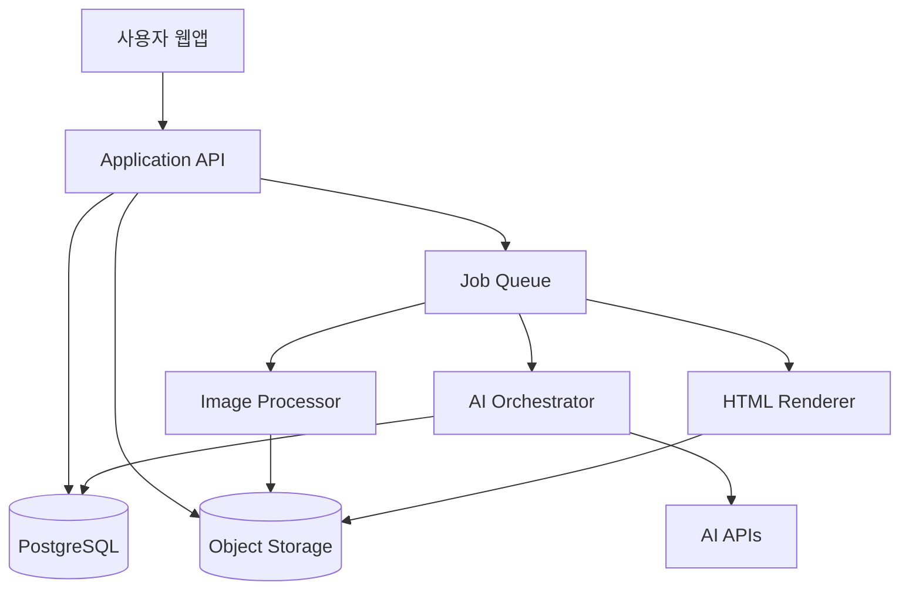
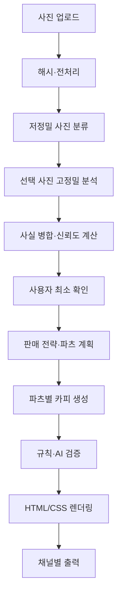

# 과일·채소 상세페이지 자동화 웹앱 기술설계서

> 문서 버전: v1.0  
> 작성일: 2026-09-09  
> 관련 문서: `상세페이지자동화_PRD.md`  
> 설계 목표: 낮은 API 비용, 구조화된 생성, 파츠 단위 편집, 사실 일관성, 채널별 재사용

---

## 1. 기술 목표

본 시스템은 과일·채소 상품 사진과 최소 사실정보를 입력받아 상세페이지의 기획·카피·디자인을 자동 생성한다. 기본 생성에서는 AI 이미지 생성 모델을 사용하지 않고, 멀티모달 분석과 텍스트 생성 결과를 구조화 JSON으로 저장한 뒤 결정론적 HTML/CSS 템플릿으로 렌더링한다.

핵심 기술 목표는 다음과 같다.

- 기본 생성 평균 AI 비용 200원 이하
- 기본 생성 95백분위 비용 300원 이하
- 파츠 단위 재생성 평균 15원 이하
- 동일 상품·이미지 분석 결과 재사용
- 상품 사실과 표현 콘텐츠 분리
- 수정된 사실정보의 전체 파츠 자동 동기화
- 모델 응답 실패 시 전체가 아닌 단계별 재시도
- 모델과 가격 변경에 대응하는 구성 기반 라우팅
- 상세페이지 콘텐츠와 판매채널 출력 규격 분리

---

## 2. 권장 기술 스택

| 영역 | 권장 기술 | 용도 |
|---|---|---|
| 프론트엔드 | Next.js, React, TypeScript | 생성·편집 UI, 서버 렌더링 |
| 스타일 | Tailwind CSS + CSS Variables | 디자인 토큰과 파츠 스타일 |
| 상태관리 | Zustand 또는 React Query | 편집 상태와 서버 상태 분리 |
| 백엔드 | Next.js Route Handlers 또는 별도 Node.js API | 인증, 생성 오케스트레이션 |
| DB | PostgreSQL | 상품, 파츠, 버전, 비용, 규칙 |
| 인증·스토리지 | Supabase Auth·Storage | 사용자·조직, 원본·가공 이미지 |
| 비동기 작업 | Postgres Queue 또는 관리형 Queue | 생성, 이미지 처리, 렌더링 |
| AI | OpenAI Responses API | 비전 분석, 구조화 출력, 카피 생성 |
| 이미지 처리 | Sharp | 리사이즈, 압축, 크롭, 포맷 변환 |
| HTML 이미지 렌더링 | Playwright 또는 Chromium | 860px 상세페이지 이미지 출력 |
| 스키마 검증 | Zod + JSON Schema | API·AI 결과 검증 |
| 관측 | OpenTelemetry + Sentry | 오류·지연·AI 호출 추적 |
| 배포 | Vercel + Supabase 또는 동급 환경 | 웹앱·API·DB·파일 저장 |

MVP는 Next.js 단일 저장소로 시작하되, 장시간 렌더링과 생성 작업은 큐 워커로 분리할 수 있게 서비스 경계를 둔다.

---

## 3. 전체 아키텍처



### 3.1 서비스 책임

| 컴포넌트 | 책임 |
|---|---|
| Web App | 업로드, 정보 확인, 파츠 편집, 미리보기, 출력 요청 |
| Application API | 인증·권한, CRUD, 작업 생성, 비용 정책 적용 |
| Image Processor | 비AI 이미지 전처리와 품질 분석 |
| AI Orchestrator | 모델 선택, 프롬프트, 구조화 출력, 재시도, 비용 기록 |
| Rules Engine | 필수정보, 금지표현, 사실 충돌, 채널 규격 검사 |
| Template Engine | 파츠 JSON을 HTML/CSS로 조립 |
| Render Worker | HTML을 전체·파츠별 이미지로 렌더링 |
| Cost Ledger | 예상·실제 토큰, 비용, 예산 사용량 기록 |

---

## 4. 설계 원칙

### 4.1 세 계층 분리

1. **Fact Layer**: 원산지, 중량, 품종, 옵션 등 검증 가능한 사실
2. **Content Layer**: 헤드라인, 설명, FAQ 등 AI가 생성한 표현
3. **Presentation Layer**: 색상, 폰트, 간격, 레이아웃, 채널 규격

사실 변경은 콘텐츠 참조값을 갱신하고, 디자인 변경은 사실·카피를 변경하지 않는다.

### 4.2 AI 응답을 완성 HTML로 받지 않음

AI는 검증 가능한 JSON만 반환한다. 완성 HTML을 모델이 직접 작성하면 토큰이 늘고 스타일 일관성, 보안, 수정 가능성이 낮아진다.

### 4.3 결정론적 렌더링

동일한 콘텐츠 JSON, 템플릿 버전, 디자인 토큰, 출력 프로필이면 동일한 결과를 생성해야 한다.

### 4.4 데이터는 원본, 결과물은 파생물

원본 상품정보와 카피 JSON을 보존한다. JPG·PNG·HTML은 언제든 다시 생성할 수 있는 파생 산출물로 취급한다.

---

## 5. 생성 파이프라인



### 5.1 단계 A: 업로드

- 클라이언트가 서명 URL을 발급받아 스토리지로 직접 업로드한다.
- 서버를 통한 대용량 파일 프록시를 피한다.
- 파일 크기, MIME, 확장자, 이미지 헤더를 검증한다.
- 허용 형식은 JPEG, PNG, WebP, HEIC 변환본으로 제한한다.

### 5.2 단계 B: 해시와 전처리

- 원본 파일의 SHA-256 해시를 생성한다.
- EXIF 방향을 보정한다.
- 분석용 이미지는 긴 변 1,536px 이하로 축소한다.
- 썸네일, 미리보기, 렌더링용 파생본을 생성한다.
- perceptual hash로 근접 중복 이미지를 탐지한다.
- 동일 해시의 과거 분석 결과가 있으면 AI 분석을 생략한다.

### 5.3 단계 C: 저정밀 사진 분류

전체 사진을 낮은 정밀도로 한 번 분석한다.

- 대표 상품
- 단면·내부
- 크기 비교
- 포장·구성
- 라벨·텍스트
- 산지·생산자
- 사용·조리
- 부적합·중복

이 단계는 상품 사실을 확정하지 않고 고정밀 분석할 사진을 고르는 역할만 한다.

### 5.4 단계 D: 선택적 고정밀 분석

다음 사진만 고정밀로 다시 분석한다.

- 라벨과 포장지처럼 OCR이 필요한 사진
- 대표 이미지 후보 중 품질 판정이 필요한 사진
- 수량·구성 확인이 필요한 사진
- 저정밀 분석 신뢰도가 임계치보다 낮은 사진

고정밀 분석 사진은 기본 최대 3장으로 제한한다. 더 필요한 경우 비용 정책이 허용할 때만 추가한다.

### 5.5 단계 E: 사실 병합

정보 출처 우선순위는 다음과 같다.

1. 사용자가 직접 확인한 값
2. 판매자 기본정보
3. 라벨 OCR에서 명확히 추출된 값
4. 사진 분석 결과
5. 카테고리 일반정보
6. 모델 추론

충돌하는 값은 자동 선택하지 않고 `needs_confirmation`으로 표시한다.

### 5.6 단계 F: 사용자 확인

- 필수정보 누락
- 출처 간 충돌
- 광고에 사용할 고위험 사실
- 신뢰도 임계치 미달

위 항목만 질문한다. 질문 응답은 가능한 한 객관식과 단위 입력으로 구성한다.

### 5.7 단계 G: 판매 전략과 파츠 계획

AI는 다음 JSON을 생성한다.

- 주·보조 판매 유형
- 대상 고객
- 구매 상황
- 핵심 메시지
- 보조 메시지
- 사용 가능한 주장
- 금지 주장
- 선택 파츠와 순서
- 파츠별 목적
- 디자인 테마 키

### 5.8 단계 H: 카피 생성

한 번의 호출로 전체 파츠의 카피 JSON을 생성하는 것을 기본으로 한다. 파츠별 개별 호출은 편집 또는 실패 복구 시에만 사용한다.

### 5.9 단계 I: 검증

1차는 결정론적 규칙 엔진이 검사한다.

- 필수 항목
- 숫자·단위 불일치
- 금지어·위험 패턴
- 사실에 없는 인증·등급·당도
- 문장 길이와 중복

2차 AI 검증은 규칙으로 판단하기 어려운 문맥만 검사한다. 전체 문서를 항상 고성능 모델로 재검토하지 않는다.

### 5.10 단계 J: 렌더링

- 콘텐츠 JSON을 파츠 컴포넌트에 주입한다.
- 디자인 토큰을 CSS Variables로 적용한다.
- 서버 렌더링 HTML을 생성한다.
- Playwright로 860px 전체 이미지와 파츠별 이미지를 캡처한다.
- 실제 페이지 높이에 따라 이미지 분할 정책을 적용한다.

---

## 6. 모델 라우팅 설계

### 6.1 구성 기반 모델 별칭

코드에 모델명을 직접 반복해서 작성하지 않는다.

```ts
type ModelRoute = {
  visionClassify: string;
  factExtract: string;
  strategy: string;
  copy: string;
  validate: string;
  premiumCopy?: string;
  imageEdit?: string;
};
```

운영 설정 예시:

```json
{
  "visionClassify": "low_cost_multimodal",
  "factExtract": "low_cost_multimodal",
  "strategy": "balanced_text",
  "copy": "balanced_text",
  "validate": "low_cost_text",
  "premiumCopy": "high_quality_text",
  "imageEdit": "image_model_optional"
}
```

실제 모델 ID와 가격은 관리자 설정 및 환경변수에서 매핑한다.

### 6.2 상향 조건

- JSON 스키마 검증 2회 실패
- 사실 출처 충돌
- 판매 유형 신뢰도 기준 미달
- 문구 품질 평가 기준 미달
- 사용자가 프리미엄 재생성을 선택

모델 상향은 해당 단계에만 적용하고 전체 파이프라인을 다시 실행하지 않는다.

### 6.3 구조화 출력

모든 AI 호출은 JSON Schema 또는 Structured Outputs를 사용한다. 응답 파싱 실패를 줄이고 불필요한 설명 토큰을 차단한다.

---

## 7. AI 출력 스키마

### 7.1 사실 추출

```ts
type Confidence = "verified" | "extracted" | "general" | "inferred" | "blocked";

type FactCandidate = {
  key: string;
  value: string | number | boolean | null;
  unit?: string;
  confidence: number;
  status: Confidence;
  sourceAssetIds: string[];
  evidenceText?: string;
  needsConfirmation: boolean;
};
```

### 7.2 상세페이지 계획

```ts
type PagePlan = {
  primarySalesType: "premium" | "gift" | "seasonal" | "value" | "convenience" | "cooking";
  secondarySalesType?: string;
  targetCustomer: string;
  purchaseContext: string;
  coreMessage: string;
  supportingMessages: string[];
  allowedClaims: string[];
  blockedClaims: string[];
  themeKey: string;
  sections: Array<{
    partType: string;
    order: number;
    purpose: string;
    layoutKey: string;
    assetIds: string[];
    factKeys: string[];
  }>;
};
```

### 7.3 파츠 콘텐츠

```ts
type PartContent = {
  partId: string;
  partType: string;
  eyebrow?: string;
  title: string;
  subtitle?: string;
  body: string[];
  highlights?: Array<{ label: string; value: string }>;
  bullets?: string[];
  footnote?: string;
  referencedFactKeys: string[];
  generatedBy: {
    model: string;
    promptVersion: string;
    generationId: string;
  };
};
```

AI가 색상 코드, 픽셀 좌표, 임의 HTML을 출력하지 않도록 한다.

---

## 8. 데이터 모델

### 8.1 핵심 테이블

#### organizations

- id
- name
- plan
- monthly_budget_krw
- created_at

#### users

- id
- organization_id
- role
- display_name
- created_at

#### seller_profiles

- id
- organization_id
- brand_name
- logo_asset_id
- producer_name
- seller_name
- customer_service
- origin_address
- shipping_policy_json
- return_policy_json
- brand_tokens_json
- version

#### products

- id
- organization_id
- seller_profile_id
- name
- category
- status
- current_version_id
- created_at
- updated_at

#### product_facts

- id
- product_id
- fact_key
- value_json
- source_type
- source_id
- confidence
- verification_status
- verified_by
- verified_at

#### product_options

- id
- product_id
- option_group
- option_value
- weight
- count
- grade
- price_optional
- sort_order

#### assets

- id
- organization_id
- storage_key
- sha256
- perceptual_hash
- mime_type
- width
- height
- file_size
- role
- quality_score
- metadata_json

#### asset_analysis

- id
- asset_id
- analysis_type
- model_key
- prompt_version
- input_hash
- result_json
- token_usage_json
- cost_usd
- expires_at

#### page_versions

- id
- product_id
- version_number
- page_plan_json
- theme_tokens_json
- channel_profile
- created_by
- created_at

#### page_parts

- id
- page_version_id
- part_type
- order_index
- layout_key
- content_json
- asset_refs_json
- fact_refs_json
- visibility
- content_hash

#### render_outputs

- id
- page_version_id
- channel_profile
- output_type
- storage_key
- width
- height
- content_hash
- created_at

#### ai_generations

- id
- organization_id
- product_id
- page_version_id
- operation
- model
- prompt_version
- request_hash
- status
- input_tokens
- cached_input_tokens
- output_tokens
- image_input_tokens
- image_output_tokens
- estimated_cost_usd
- actual_cost_usd
- exchange_rate
- actual_cost_krw
- latency_ms
- retry_of
- created_at

#### rules

- id
- rule_type
- category
- pattern_or_config
- severity
- version
- active

#### prompt_versions

- id
- prompt_key
- version
- content_hash
- schema_version
- active
- created_at

### 8.2 불변 데이터와 편집 데이터

- 상품 사실은 `product_facts`에서 관리한다.
- AI 카피는 `page_parts.content_json`에 저장한다.
- 디자인은 `page_versions.theme_tokens_json`과 `layout_key`에서 관리한다.
- 렌더링 파일은 원본이 아니라 파생물이다.

---

## 9. API 설계

### 9.1 주요 엔드포인트

```text
POST   /api/uploads/presign
POST   /api/products
GET    /api/products/:id
PATCH  /api/products/:id/facts
POST   /api/products/:id/analyze
POST   /api/products/:id/confirm-facts
POST   /api/products/:id/generate
GET    /api/jobs/:jobId
PATCH  /api/page-versions/:id/theme
PATCH  /api/page-parts/:id
POST   /api/page-parts/:id/regenerate
POST   /api/page-versions/:id/validate
POST   /api/page-versions/:id/render
POST   /api/page-versions/:id/duplicate
POST   /api/page-versions/:id/restore
GET    /api/products/:id/costs
GET    /api/admin/cost-dashboard
```

### 9.2 멱등성

생성·분석·렌더링 요청은 `Idempotency-Key`를 받는다. 동일 키와 동일 입력 해시의 요청은 기존 작업 결과를 반환한다.

### 9.3 비동기 작업 상태

```text
queued → preprocessing → analyzing → awaiting_confirmation
→ planning → writing → validating → rendering → completed
```

실패 상태는 단계명과 함께 저장한다. 예: `failed:writing`. 재시도는 해당 단계부터 수행한다.

---

## 10. 편집기 기술 설계

### 10.1 파츠 기반 편집

- 중앙 미리보기는 실제 HTML 컴포넌트를 사용한다.
- 왼쪽 패널은 파츠 목록과 순서를 관리한다.
- 오른쪽 패널은 선택된 파츠의 콘텐츠·이미지·레이아웃을 관리한다.
- 드래그 순서는 `order_index`만 변경한다.
- 디자인 테마 변경은 CSS Variables만 갱신한다.

### 10.2 직접 편집

- 텍스트는 허용된 필드만 편집한다.
- 저장 시 HTML 태그를 제거하거나 제한된 마크업만 허용한다.
- 사실값 토큰은 일반 텍스트가 아니라 참조 형태로 유지할 수 있다.

예:

```json
{
  "title": "{{product.name}}의 구성",
  "body": ["한 상자에 {{option.count}}과를 담았습니다."]
}
```

사실 변경 시 참조값이 자동으로 갱신된다.

### 10.3 AI 부분 수정

부분 수정 요청에는 다음만 전달한다.

- 선택 파츠의 현재 콘텐츠
- 해당 파츠가 참조하는 사실
- 페이지의 핵심 메시지와 톤 요약
- 사용자의 수정 명령
- 적용해야 할 문장 규칙

전체 페이지, 전체 이미지, 모든 생성 이력을 다시 전달하지 않는다.

### 10.4 버전 전략

- 작은 편집은 자동 저장 스냅샷에 기록한다.
- 출력, 전체 재생성, 사실 대량 변경 시 명시적 `page_version`을 생성한다.
- 파츠 수정 이력은 JSON Patch 또는 이벤트 로그로 저장할 수 있다.

---

## 11. 렌더링 시스템

### 11.1 파츠 컴포넌트

```text
HeroPart
SummaryPart
AudiencePart
TasteTexturePart
OriginDifferencePart
SizeAppearancePart
OptionsPart
EvidencePart
UsagePart
StoragePart
ShippingPart
NoticeFaqPart
```

각 컴포넌트는 사전 정의된 `layout_key`만 지원한다.

### 11.2 디자인 토큰

```ts
type ThemeTokens = {
  colors: {
    background: string;
    surface: string;
    primary: string;
    accent: string;
    text: string;
    muted: string;
  };
  typography: {
    headingFont: string;
    bodyFont: string;
    scale: "compact" | "normal" | "large";
  };
  radius: "none" | "soft" | "round";
  spacing: "compact" | "normal" | "airy";
  imageStyle: "full" | "card" | "cutout";
};
```

### 11.3 출력 프로필

```ts
type ChannelProfile = {
  key: string;
  width: number;
  imageFormat: "jpeg" | "png" | "webp";
  maxSegmentHeight?: number;
  jpegQuality?: number;
  allowHtml: boolean;
  cssOverrides?: Record<string, string>;
};
```

기본 프로필:

- `naver_860_image`
- `coupang_detail_image`
- `responsive_html`

---

## 12. 비용 최적화 상세 설계

### 12.1 요청 전 비용 예측

```ts
type CostEstimate = {
  expectedInputTokens: number;
  expectedOutputTokens: number;
  expectedImageInputTokens: number;
  expectedImageOutputTokens: number;
  expectedUsd: number;
  expectedKrw: number;
  budgetStatus: "ok" | "warning" | "blocked";
};
```

예측값은 과거 동일 작업의 실제 사용량 이동평균과 사진 수·해상도·선택 파츠 수를 조합해 산정한다.

### 12.2 캐시 키

```text
vision:{asset_sha256}:{analysis_type}:{model}:{prompt_version}
strategy:{facts_hash}:{model}:{prompt_version}
copy:{page_plan_hash}:{facts_hash}:{tone}:{model}:{prompt_version}
validate:{content_hash}:{rules_version}:{model}:{prompt_version}
render:{page_hash}:{template_version}:{channel_profile}
```

### 12.3 프롬프트 캐싱

- 안정적인 시스템 규칙과 JSON Schema를 프롬프트 앞부분에 배치한다.
- 상품별 가변정보를 뒤쪽에 배치한다.
- 프롬프트 버전을 불필요하게 자주 변경하지 않는다.
- 동일 조직·상품군의 공통 접두부가 재사용되게 구성한다.

### 12.4 출력 토큰 제한

- 판매 전략 출력은 1,200 토큰 이내를 목표로 한다.
- 전체 파츠 카피는 기본 3,500 토큰 이내로 제한한다.
- 모델에게 설명이나 사고과정이 아닌 JSON 결과만 요구한다.
- 파츠별 본문 길이를 스키마와 후처리 규칙으로 제한한다.

### 12.5 이미지 비용 절감

- 모든 사진은 분석 전에 축소본을 사용한다.
- 전체 사진은 low detail, 라벨 후보만 high detail로 처리한다.
- 동일 사진의 반복 분석을 금지한다.
- 일반 보정은 Sharp에서 수행한다.
- 배경 제거는 로컬 또는 정액형 처리 가능성을 우선 검토한다.
- AI 이미지 편집은 별도 유료 크레딧 기능으로 분리한다.
- 상세페이지 배경·도형·아이콘은 SVG와 CSS로 생성한다.

### 12.6 재시도 정책

| 오류 | 처리 |
|---|---|
| 네트워크·429·5xx | 지수 백오프, 최대 2회 |
| JSON 파싱 실패 | 동일 모델 스키마 재시도 1회 |
| 내용 검증 실패 | 실패 필드만 수정 요청 |
| OCR 신뢰도 미달 | 선택 사진 1장만 고정밀 재분석 |
| 카피 품질 미달 | 해당 파츠만 재생성 |
| 예산 초과 예상 | 모델 하향 또는 사용자 확인 |

전체 생성 자동 재시도는 최대 1회로 제한한다.

### 12.7 기본 예산 정책

```json
{
  "default_generation_target_krw": 200,
  "default_generation_hard_cap_krw": 300,
  "part_regeneration_target_krw": 15,
  "full_copy_regeneration_cap_krw": 150,
  "warn_ratio": 0.8,
  "image_generation_enabled": false
}
```

단가는 코드에 고정하지 않고 `model_pricing` 설정에 저장한다.

### 12.8 실제 비용 원장

AI 응답의 usage를 기준으로 호출별 실제비용을 기록한다.

```text
actual_cost_usd =
  input_tokens × input_rate
  + cached_input_tokens × cached_input_rate
  + output_tokens × output_rate
  + image_input_tokens × image_input_rate
  + image_output_tokens × image_output_rate
```

원화 비용은 호출 당시 또는 일일 고정 환율을 적용한다. 운영비 예측에는 결제 수수료와 환율 안전계수 10~15%를 별도 적용한다.

---

## 13. 규칙 엔진

### 13.1 규칙 유형

- `required_fact`
- `fact_consistency`
- `blocked_phrase`
- `claim_requires_evidence`
- `category_restriction`
- `channel_requirement`
- `copy_quality`
- `image_integrity`

### 13.2 예시

```json
{
  "ruleType": "claim_requires_evidence",
  "category": "fresh_produce",
  "terms": ["무농약", "유기농", "친환경", "15브릭스", "특품", "1등급"],
  "requiredFactStatus": "verified",
  "severity": "block"
}
```

### 13.3 AI 검증 사용 기준

AI 검증은 문맥상 의미가 달라질 수 있는 표현에만 사용한다. 단순 금지어, 숫자, 단위, 필수정보는 코드로 검사한다.

---

## 14. 보안과 개인정보

- 조직 단위 Row Level Security 적용
- 원본 이미지와 생성 결과의 조직별 경로 분리
- 서명 URL은 짧은 만료시간 적용
- API 키는 서버 환경변수 또는 비밀 저장소에 보관
- 클라이언트에 AI API 키 노출 금지
- 업로드 MIME과 실제 파일 헤더 이중 검증
- SVG 업로드는 초기 버전에서 금지하거나 정화 처리
- 사용자 입력 HTML은 허용하지 않음
- 로그에 원본 이미지 URL, API 키, 개인정보 기록 금지
- 삭제 요청 시 원본·파생물·캐시의 보존정책 적용

---

## 15. 성능과 확장성

### 15.1 목표 성능

| 작업 | 목표 |
|---|---:|
| 업로드 후 전처리 | 사진 8장 기준 10초 이내 |
| 저정밀 분석 | 15초 이내 |
| 전체 카피 생성 | 20초 이내 |
| 기본 HTML 미리보기 | 3초 이내 |
| 파츠 텍스트 재생성 | 10초 이내 |
| 전체 이미지 렌더링 | 20초 이내 |

### 15.2 확장 전략

- 비동기 작업은 stateless worker로 실행한다.
- 큐 작업에는 조직·상품·단계·멱등성 키를 포함한다.
- 생성과 렌더링 워커를 별도 확장한다.
- 이미지 파생본은 CDN 캐시를 사용한다.
- 템플릿과 렌더 출력은 콘텐츠 해시로 캐시한다.

---

## 16. 오류 처리

### 16.1 사용자 오류 메시지

- 기술 오류 대신 현재 단계와 해결 방법을 표시한다.
- 완료된 단계는 보존한다.
- 다시 시도할 때 비용이 발생하는 경우 사전 안내한다.

예:

```text
상품 사진 분석은 완료되었습니다.
문구 생성 중 일시적인 오류가 발생했습니다.
사진을 다시 올리지 않고 문구 생성부터 다시 진행합니다.
```

### 16.2 데이터 일관성

- 작업 결과는 임시 버전에 기록한 후 검증 완료 시 현재 버전으로 승격한다.
- 실패한 AI 결과가 현재 공개 버전을 덮어쓰지 않도록 한다.
- 렌더링 중 편집이 발생하면 입력 해시를 비교해 오래된 결과 저장을 차단한다.

---

## 17. 관측과 운영 대시보드

### 17.1 필수 지표

- 생성 건수와 완료율
- 단계별 성공·실패율
- 모델별 입력·출력·이미지 토큰
- 호출별·상품별·조직별 비용
- 캐시 적중률
- 재시도율
- 모델 상향률
- 단계별 지연시간
- 전체·파츠 재생성 비율
- 생성 후 직접 수정률
- 검증 경고·차단 건수

### 17.2 비용 알림

- 조직 월 예산 70%, 90%, 100% 알림
- 단일 생성 300원 초과 감지
- 모델별 평균비용 급등 감지
- 캐시 적중률 급락 감지
- 이미지 생성 기능의 비정상 호출 감지

---

## 18. 테스트 전략

### 18.1 단위 테스트

- 사실 우선순위 병합
- 단위 변환과 표시
- 금지어·근거 필요 표현
- 파츠 선택 규칙
- 비용 계산
- 캐시 키 생성
- 디자인 토큰 검증

### 18.2 계약 테스트

- AI JSON Schema 준수
- 모델별 usage 필드 파싱
- 스토리지 업로드·다운로드
- 렌더러 입력·출력

### 18.3 골든 데이터셋

대표 상품군별 검증용 사례를 구축한다.

- 사과·배·복숭아·포도·감귤·수박
- 감자·고구마·당근·양파·잎채소
- 선물용·가정용·못난이·대용량·소포장
- 라벨이 선명한 사진과 불명확한 사진
- 정보 충돌 사례
- 인증·당도 근거 유무 사례

각 사례에는 기대 사실정보, 허용 주장, 금지 주장, 권장 파츠, 필수 안내를 포함한다.

### 18.4 시각 회귀 테스트

- 파츠별 스크린샷 비교
- 860px 전체 페이지 비교
- 텍스트 넘침과 이미지 잘림 탐지
- 모바일 가독성 검사
- 긴 옵션명과 긴 생산자명 테스트

### 18.5 비용 회귀 테스트

- 고정 골든 입력에 대한 토큰 사용량 기준선 설정
- 프롬프트 변경 시 예상비용 증가율 검사
- 20% 이상 증가하면 배포 승인 필요

---

## 19. 배포 구조

### 19.1 환경

- Development
- Staging
- Production

환경별로 DB, 스토리지 버킷, AI 비용 한도와 모델 라우팅을 분리한다.

### 19.2 배포 원칙

- DB 마이그레이션은 버전 관리한다.
- 프롬프트와 규칙도 애플리케이션 버전과 연결한다.
- 모델 변경은 기능 플래그로 점진 적용한다.
- 신규 템플릿은 시각 회귀 테스트 통과 후 공개한다.
- 고비용 기능은 서버 플래그와 조직 권한을 모두 확인한다.

---

## 20. MVP 구현 순서

### Sprint 1. 기반

- 프로젝트·인증·조직 구조
- DB 스키마와 RLS
- 스토리지 업로드
- 상품·판매자 기본정보 CRUD
- 비용 원장 기본 구조

### Sprint 2. 이미지와 사실

- 이미지 전처리
- 해시·중복 탐지
- 저정밀 분류
- 선택적 고정밀 OCR·사실 추출
- 사용자 확인 UI

### Sprint 3. 생성

- 판매 유형과 페이지 계획
- 구조화 카피 생성
- 규칙 엔진 1차
- AI 문맥 검증
- 토큰·비용 계측

### Sprint 4. 렌더링

- 12개 파츠 컴포넌트
- 3개 디자인 테마
- 반응형 미리보기
- 860px 전체·분할 이미지 렌더링

### Sprint 5. 편집

- 파츠 순서·표시·레이아웃
- 텍스트·이미지 직접 수정
- 파츠별 AI 재생성
- 사실정보 동기화
- 자동 저장·버전 복원

### Sprint 6. 운영 안정화

- 비용 한도·알림
- 관리자 규칙·템플릿·모델 설정
- 골든 데이터셋 평가
- 시각·비용 회귀 테스트
- 오류 복구와 재시도 개선

---

## 21. 기술적 의사결정 요약

| 항목 | 결정 |
|---|---|
| 최종 상세페이지 생성 | HTML/CSS 템플릿 렌더링 |
| AI 역할 | 비전 분석, 전략, 구조화 카피, 문맥 검증 |
| AI 이미지 생성 | 기본 비활성화, 선택 기능 |
| 편집 방식 | 제한형 파츠 편집기 |
| 사실정보 | 중앙 데이터에서 전역 참조 |
| AI 결과 | JSON Schema 기반 저장 |
| 수정 호출 | 파츠 단위 델타 생성 |
| 이미지 분석 | 저정밀 전체 + 고정밀 선택 |
| 캐시 | 사진·사실·카피·검증·렌더 단계별 해시 캐시 |
| 비용 통제 | 요청 전 예측 + 호출 후 원장 + 상한 정책 |
| 기본 비용 상한 | 생성 1건 300원 |
| 출력 | 860px 이미지 + 반응형 HTML |

---

## 22. 참고 문서

- [OpenAI API Pricing](https://developers.openai.com/api/docs/pricing)
- [OpenAI Images and Vision Guide](https://developers.openai.com/api/docs/guides/images-vision)
- [OpenAI Image Generation Guide](https://developers.openai.com/api/docs/guides/image-generation)
- [전자상거래 등에서의 상품 등의 정보제공에 관한 고시](https://www.law.go.kr/admRulInfoP.do?admRulSeq=2100000036285)
- [식품 등 온라인 부당광고 사례집](https://www.mfds.go.kr/brd/m_218/view.do?seq=33711)
- [스마트스토어 상품 상세설명 주요사항](https://help.sell.smartstore.naver.com/faq/content.help?faqId=3923)

